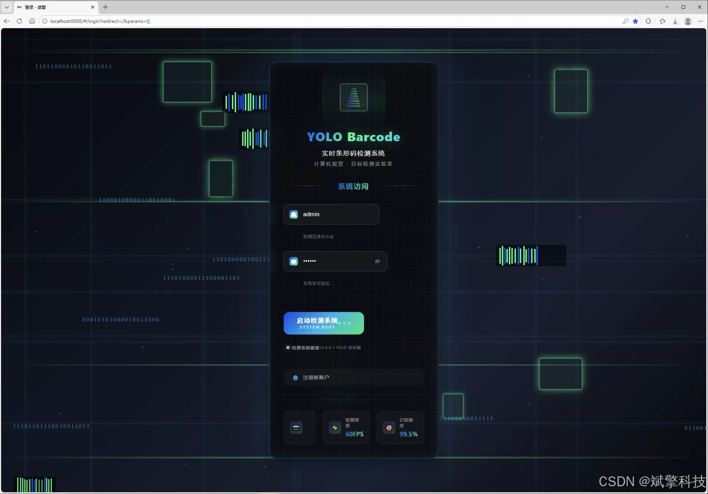
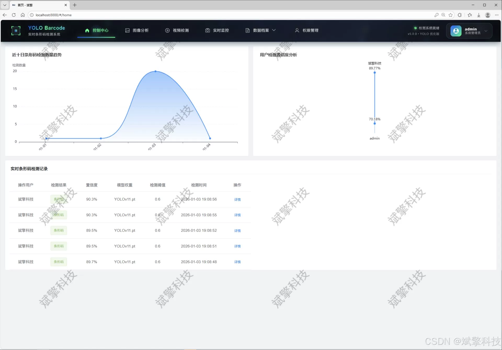
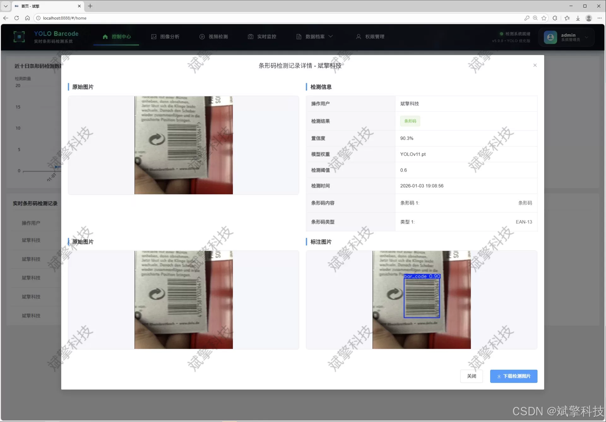
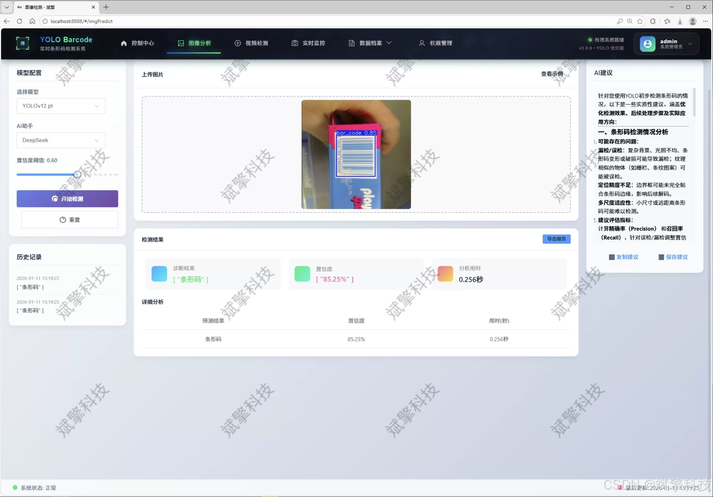
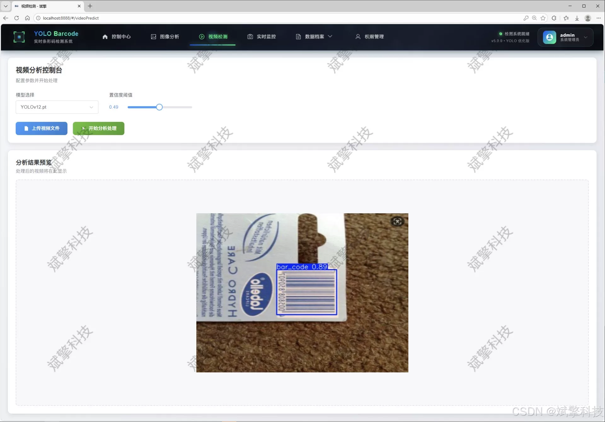
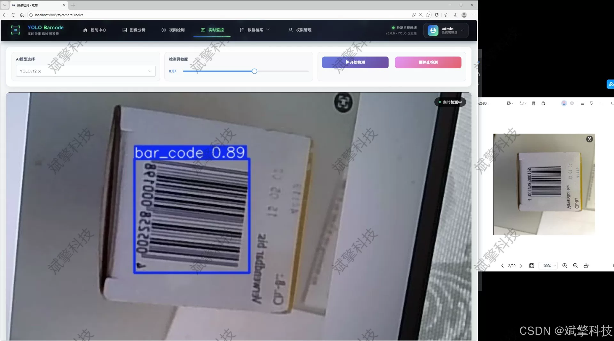
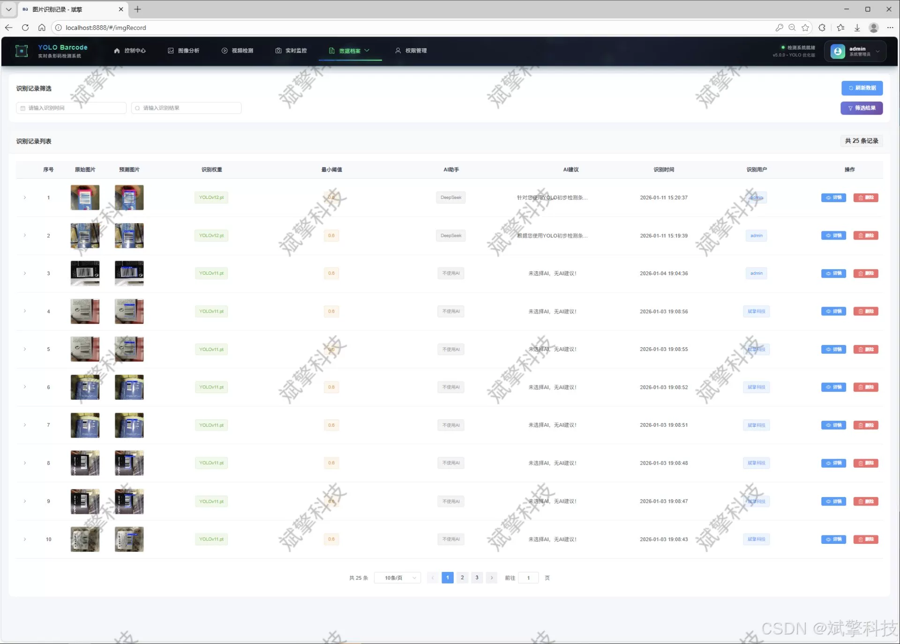
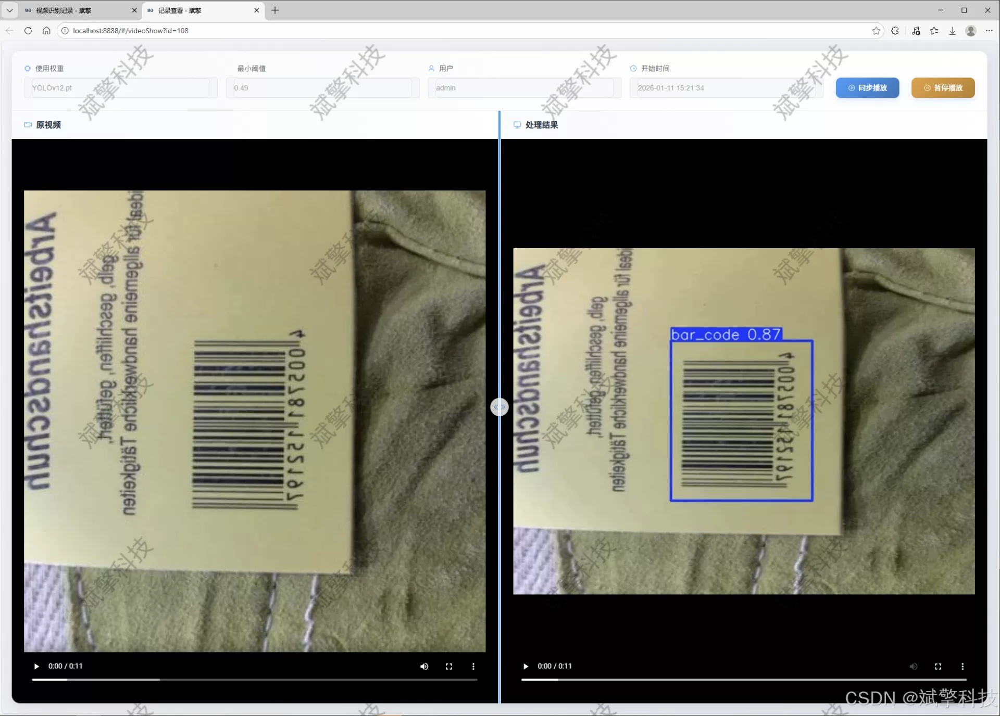
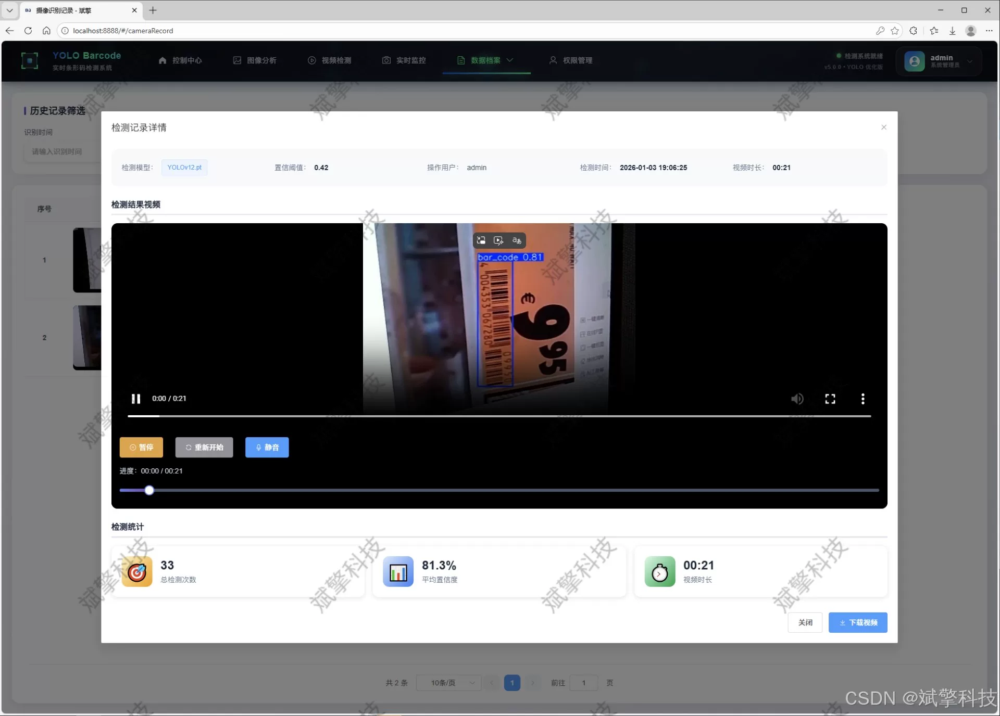

# YOLO+Large Model Barcode Detection System

## Body

The YOLO+ large model barcode detection system is based on the YOLO deep learning and the large models of Qianwen and DeepSeek. The system combines DeepSeek intelligent analysis with a web interaction interface, separating the frontend and backend, using YOLO data, and supporting YOLOv8/YOLOv10/YOLOv11/YOLOv12.

The project has designed and implemented an efficient barcode detection and analysis system based on deep learning. The system adopts a front-end-backend separation architecture, with the backend based on the SpringBoot framework and the front end providing a modern Web interaction interface. It also uses MySQL database for data persistence management. In terms of core detection algorithms, the system innovatively integrates and compares the most advanced YOLO series object detection models (including YOLOv8, YOLOv10, YOLOv11, and YOLOv12) and has built a specialized dataset for barcode detection scenarios.

The system is comprehensive in functionality, supporting precise localization and detection of barcode regions in real-time streams from images, videos, and cameras. It also integrates DeepSeek large language model, scene understanding, and potential application suggestions deeply. Additionally, the system includes complete user permission management, detection record traceability, multi-dimensional data visualization, and an administrator's backend. Experimental results show that the system can efficiently and accurately locate barcode regions in complex backgrounds, providing a powerful and scalable intelligent barcode processing platform for applications such as retail warehousing, logistic sorting, asset management, and smart libraries.

Functional module

✅ User Login and Registration: Supports password detection, saves to MySQL database.

✅ Supports four YOLO model switches, YOLOv8, YOLOv10, YOLOv11, YOLOv12.

✅ Information Visualization, Data Visualization.

✅ Image detection supports AI analysis functions, deepseek and Qianwen.

✅ Supports image detection, video detection, and real-time camera detection. The results are saved to a MySQL database.

✅ Picture recognition record management, video recognition record management and camera recognition record management.

✅ User Management Module, administrators can add, delete, modify, and query users.

✅ Personal center, can modify their own information, password name profile picture and so on.

There is no Lunwen writing service, nor any Lunwen.

## Images

## Payment

Here is a pay link on Stripe ( https://buy.stripe.com/3cs8yP7sY87d0vu9AB ). Please contact me lonlonago@foxmail.com after funding $89, and I will send you a complete data files , thank you!

